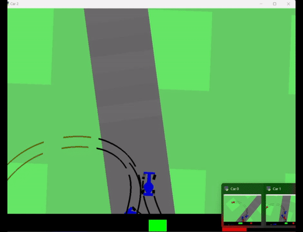
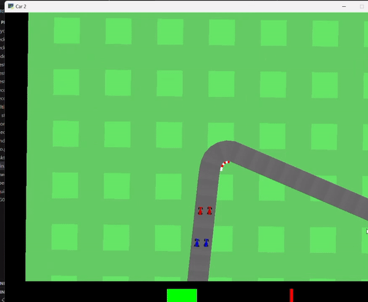
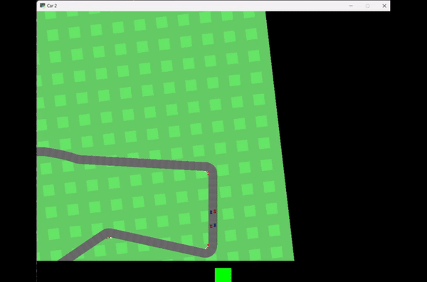

# Multi-Car Racing Solved Environment

## Overview
This project is based on the concepts presented in the paper [Emergent Coordination Through Competition](https://openreview.net/pdf?id=BkG8sjR5Km). The paper discusses how competition among agents can lead to emergent coordination. Here, we have implemented a population-based algorithm to address the multi-car racing challenge. While the paper utilizes the [SVG0](https://arxiv.org/pdf/1510.09142) algorithm, this implementation leverages the [DDPG](https://arxiv.org/pdf/1509.02971) algorithm to optimize agent performance.

## Installation

1. **Install And Set Up The Environment:**
    Please follow the steps in this git: [https://github.com/igilitschenski/multi_car_racing.git](https://github.com/igilitschenski/multi_car_racing.git)

2. **Ensure Python Version:**
    Make sure you are using Python version greater than 3.11.

3. **Install Dependencies:**
    In case there are issues with the environment installation, especially with `Box-2D`, try to install:
    ```bash
    pip install shapely
    ```

4. **Install Required Packages:**
    ```bash
    pip install -r requirements.txt
    ```

## Usage

After successfully installing the required packages, you can run the main script with different arguments:

- To **train the model**:
    ```bash
    python .\main -t
    ```

- To **resume training from a checkpoint**:
    ```bash
    python .\main -t -c
    ```

- To **evaluate the best models**:
    ```bash
    python .\main -e
    ```

- To **evaluate on a checkpoint**:
    ```bash
    python .\main -e -c
    ```
## Results







## Contact

For any issues or questions, feel free to contact me at meconidomenico@gmail.com

Enjoy racing! 🚗💨

---
